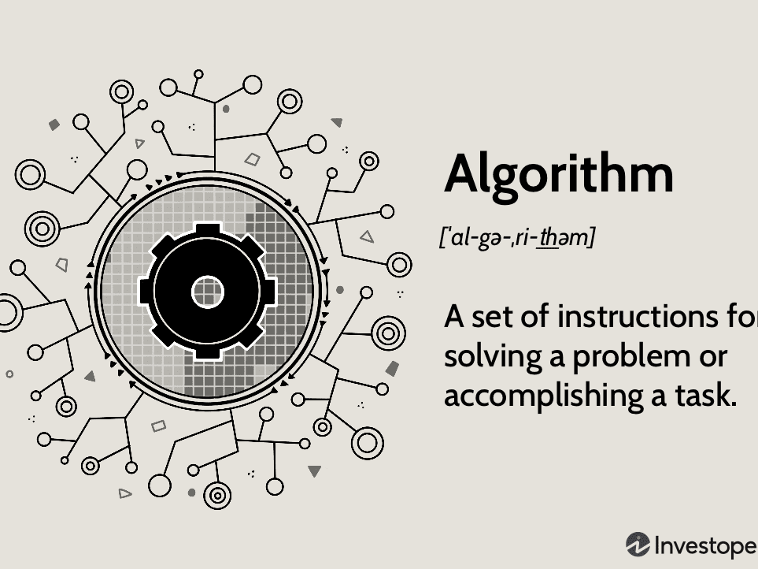

<div id="top"></div>

<!--
*** https://www.markdownguide.org/basic-syntax/#reference-style-links
-->


<!-- PROJECT LOGO -->
<br />
<div align="center">
 <h3 align="center">Algorithms and Data Structures</h3>
  <a href="https://github.com/SalMireles/algorithms">
    
  </a>
</div>


<!-- TABLE OF CONTENTS -->
<details>
  <summary>Table of Contents</summary>
  <ol>
    <li>
      <a href="#about-the-project">About The Project</a>
      <ul>
        <li><a href="#built-with">Built With</a></li>
      </ul>
    </li>
    <li>
      <a href="#getting-started">Getting Started</a>
      <ul>
        <li><a href="#prerequisites">Prerequisites and Usage</a></li>
      </ul>
    </li>
    <li><a href="#roadmap">Roadmap</a></li>
    <li><a href="#acknowledgments">Acknowledgments</a></li>
  </ol>
</details>


<!-- ABOUT THE PROJECT -->
## About The Project
<!-- [![Product Name Screen Shot][product-screenshot]](https://example.com) -->

Algorithms and Data Structures implementation in java and python

##### Content
- Union Find
- Stacks and Queues
- Elementary Sorts
- Mergesort
- Quicksort
- Priority Queues
- Elementary Symbol Tables
- Balanced Search Trees
- Geometric Applications of BST's
- Hash Tables
- Symbol Tables Applications

<p align="right">(<a href="#top">back to top</a>)</p>


### Built With

  [![java][java-shield]][java-url]

<p align="right">(<a href="#top">back to top</a>)</p>


<!-- GETTING STARTED -->
## Getting Started

### Prerequisites and usage for MacOSX (M1)

This is an example of how to list things you need to use the software and how to install them.
1. Download and install java (https://www.java.com/en/download/)
   - Test in terminal
    ```console
    > java
    Usage: java [-options] class [args...]
    ```
    ```console
    > java -version
    java version "1.8.0_341"
    Java(TM) SE Runtime Environment (build 1.8.0_341-b10)
    Java HotSpot(TM) 64-Bit Server VM (build 25.341-b10, mixed mode)
    ```
2. Download and install the java jdk (https://www.oracle.com/java/technologies/downloads/#jdk19-mac)
    - Test in terminal
    ```console
    > java -version
    java version "19" 2022-09-20
    Java(TM) SE Runtime Environment (build 19+36-2238)
    Java HotSpot(TM) 64-Bit Server VM (build 19+36-2238, mixed mode, sharing)
    ```
    - Get path
    ```console
    > /usr/libexec/java_home
    /Library/Java/JavaVirtualMachines/jdk-19.jdk/Contents/Home
    ```
    - Set env variables in bash or zsh profile then restart shell
    ```console
    export JAVA_HOME=/Library/Java/JavaVirtualMachines/jdk-19.jdk/Contents/Home
    export PATH=%JAVA_HOME/bin:$PATH
    ```
    - Test by creating sample code in a file named QuickStart.java
    ```java
    class QuickStart {
    public static void main (String[] args) {
        System.out.println("Hello, World.");
      }
    }
    ```
    - Compile
    ```console
    > javac QuickStart.java
    > ls
    QuickStart.class
    ```
    - Run
    ```console
    > java QuickStart
    Hello, World.
    ```
  3. If using vscode install coding pack for easier development: https://code.visualstudio.com/docs/java/java-tutorial
      - This installs the following extensions:
        - `Extension Pack for Java`
        - `Debugger for Java`
        - `Maven for Java` 
        - `Project Manager for Java`
        - `Test Runner for Java`


<!-- ROADMAP -->
## Roadmap
[Roadmap Google Doc](https://docs.google.com/document/d/1wxfN9haQJJzIbvNFIJ08FxyTRKbjyIIJi_hvV0IHcaQ/edit)
- [x] Setup Java Dev Environment
- [ ] Week 1
  - [ ] Hello, World
  - [ ] Union Find
  - [ ] Analysis of Algorithms
- [ ] Week 2
  - [ ] Stacks and Queues
  - [ ] Elementary Sorts
- [ ] Week 3
  - [ ] Mergesort
  - [ ] Quicksort
- [ ] Week 4
  - [ ] Priority Queues
  - [ ] Elementary Symbol Tables
- [ ] Week 5
  - [ ] Balanced Search Trees
  - [ ] Geometric Applications of BST's
- [ ] Week 6
  - [ ] Hash Tables
  - [ ] Symbol Tables Applications

<p align="right">(<a href="#top">back to top</a>)</p>


<!-- ACKNOWLEDGMENTS -->
## Acknowledgments

* [Algorithms, Part 1, Princeton University](https://www.coursera.org/learn/algorithms-part1/home)

<p align="right">(<a href="#top">back to top</a>)</p>


<!-- MARKDOWN LINKS & IMAGES -->
<!-- https://www.markdownguide.org/basic-syntax/#reference-style-links -->
<!-- https://github.com/Ileriayo/markdown-badges -->
<!-- https://dev.to/envoy_/150-badges-for-github-pnk -->

[java-shield]: https://img.shields.io/badge/Java-ED8B00?style=for-the-badge&logo=java&logoColor=white

[java-url]: https://www.java.com/en/
